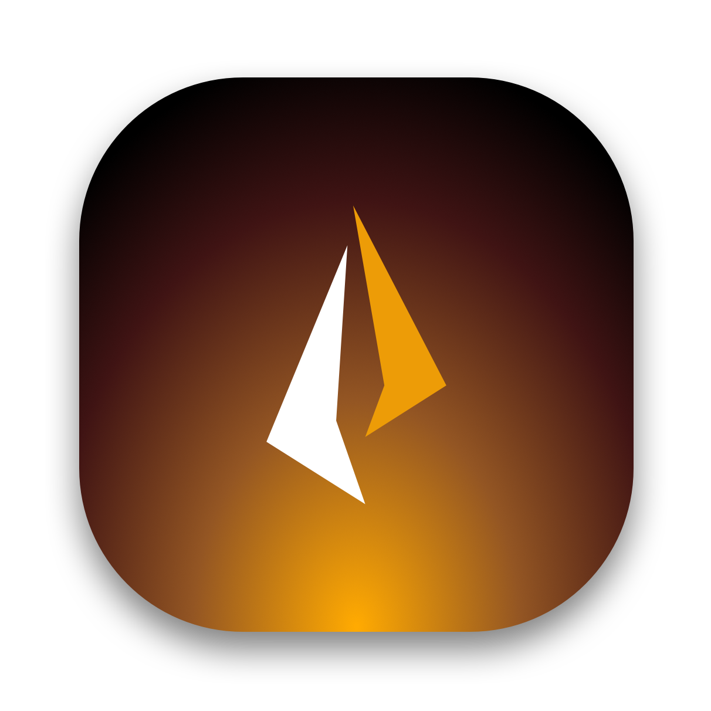

# IgKnite
Unified, swiss-grade moderation & music bot for Discord

> [!NOTE]
> The repository has been migrated and recreated from the original "IgKniteDev" organization. Support the development
> by giving a star! :D

## Table of Contents

- [Key Features](#key-features)
- [Setup](#setup)
- [Contributing](#contributing)
- [License](#license)

## Key Features

- 🐍 Based on native Python, along with [Docker integration](https://docker.com/) for easy deployment.
- ⚡ Designed entirely for slash commands, with minimal user interface.
- 🔨 Powerful moderation commands for easy access to handy Discord moderation.
- 🎤 Smooth music playback via a music system built from scratch.
- 💻 Low-latency feedback and efficient use of Discord API calls.

## Setup

The primary setup requirements for this project are [uv](https://astral.sh/uv)
and [ffmpeg](https://ffmpeg.org/). For prebuilt Docker images, please refer to
the [packages](https://github.com/hitblast?tab=packages&repo_name=IgKnite)
section.

```bash
# Clone the repository and set as current working directory.
git clone git@github.com:hitblast/IgKnite.git && cd IgKnite

# Install dependencies.
uv sync
```

Then, copy the required environment secrets into a new `.env` file like this:

```bash
# Copy .env.sample into .env using cp.
cp .env.sample .env

# Edit using your favorite code editor.
nvim .env
```

Additionally, please note that alongside the traditionally required secrets for
running the bot, IgKnite also requires a client ID and secret from the [Spotify Developer Portal](https://developer.spotify.com/)
in order to search Spotify for URI inputs.

Finally, to run the bot, execute:

```bash
uv run igknite run
# If the virtual environment is activated already:
#       igknite run
```

## Contributing

Pull requests are always welcome! Please follow the [Code of
Conduct](./CODE_OF_CONDUCT.md) for ethical guidelines regarding code
contributions.

## License

This project is licensed under the MIT License - see the [LICENSE](./LICENSE) file for details.
